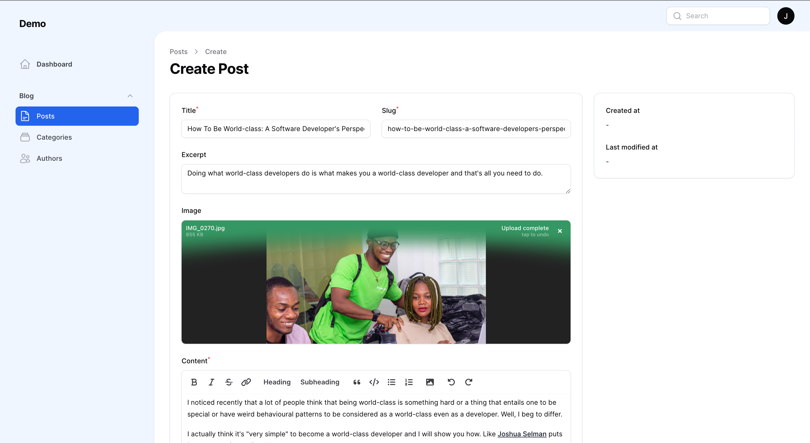
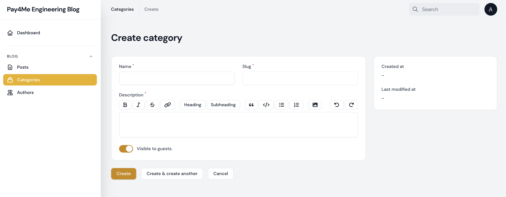
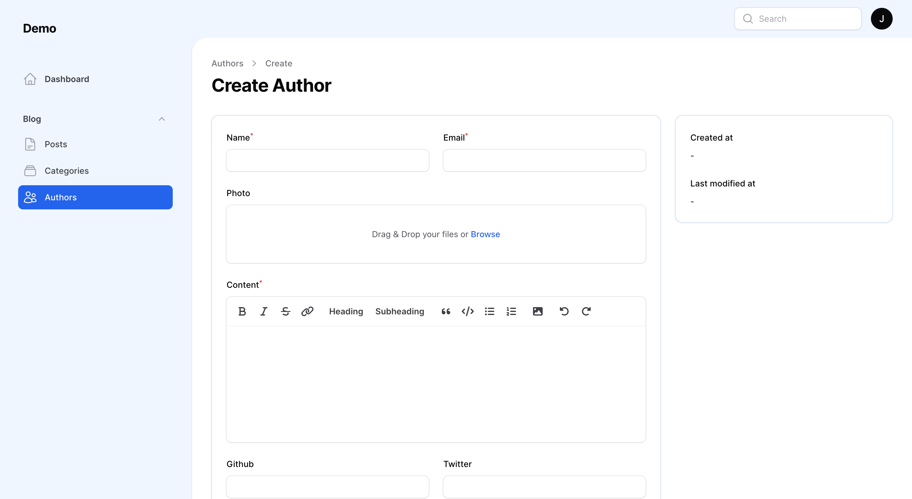

# Filament Blog Builder

[](https://packagist.org/packages/stephenjude/filament-blog)
[](https://github.com/stephenjude/filament-blog/actions?query=workflow%3Arun-tests+branch%3Amain)
[](https://github.com/stephenjude/filament-blog/actions?query=workflow%3A"Check+%26+fix+styling"+branch%3Amain)
[](https://packagist.org/packages/stephenjude/filament-blog)

A faceless blog content manager with configurable richtext and markdown support for filament admin panel.



## Filament Admin Panel
This package is tailored for [Filament Admin Panel](https://filamentphp.com/). 

Make sure you have installed the admin panel before you continue with the installation. You can check the [documentation here](https://filamentphp.com/docs/admin)

## Supported Versions
PHP: `8.0` & `8.1`

Laravel: `8` & `9`

## Installation
You can install the package via composer:

```bash
composer require stephenjude/filament-blog

php artisan filament-blog:install

php artisan storage:link

php artisan migrate
```


## Displaying your content
Filment blog builder is faceless, it doesn't have any opinions on how you display your content in your frontend. You can use the blog models in your controllers to display the different resources:

- `Stephenjude\FilamentBlog\Models\Post`
- `Stephenjude\FilamentBlog\Models\Author`
- `Stephenjude\FilamentBlog\Models\Category`

### Posts & Drafts
```php 
$posts = Post::published()->get();

$drafts = Post::draft()->get();

```

### Post Content
```php
$post = Post::find($id);

$post->id;
$post->title;
$post->slug;
$post->excerpt;
$post->banner_url;
$post->content;
$post->published_at;
```

### Post Category & Author
```php
$post = Post::with(['author', 'category'])->find($id);

$author = $post->author;

$author->id;
$author->name;
$author->email;
$author->photo;
$author->bio;
$author->github_handle;
$author->twitter_handle;


$category = $post->category;

$category->id;
$category->name;
$category->slug;
$category->description;
$category->is_visible;
$category->seo_title;
$category->seo_description;

```

### Configurations
This is the contents of the published config file:

```php
<?php

return [

    /**
     * In your application you may have User model already existing
     * you can pass the user model class name to this option
     * and replace the default built-in Author model
     * with your custom User Model.
     */
    'author_model' => \Stephenjude\FilamentBlog\Models\Author::class,

    /**
     * This option let you add or remove resources that this package
     * expose as Blog section in to your filament admin sidebar
     * it is usefull when you want to use custom Author model
     * and, you want to hide the AuthorResource
     */
    'resources' => [
        \Stephenjude\FilamentBlog\Resources\AuthorResource::class,
        \Stephenjude\FilamentBlog\Resources\CategoryResource::class,
        \Stephenjude\FilamentBlog\Resources\PostResource::class,
    ],
    /**
     * Supported content editors: richtext & markdown:
     *      \Filament\Forms\Components\RichEditor::class
     *      \Filament\Forms\Components\MarkdownEditor::class
     */
    'editor' => \Filament\Forms\Components\RichEditor::class,

    /**
     * Buttons for text editor toolbar.
     */
    'toolbar_buttons' => [
        'attachFiles',
        'blockquote',
        'bold',
        'bulletList',
        'codeBlock',
        'h2',
        'h3',
        'italic',
        'link',
        'orderedList',
        'redo',
        'strike',
        'undo',
    ],
];
```

## More Screenshots



---



## Testing

```bash
composer test
```

## Changelog

Please see [CHANGELOG](CHANGELOG.md) for more information on what has changed recently.

## Contributing

Please see [CONTRIBUTING](.github/CONTRIBUTING.md) for details.

## Security Vulnerabilities

Please review [our security policy](../../security/policy) on how to report security vulnerabilities.

## Credits

- [stephenjude](https://github.com/stephenjude)
- [All Contributors](../../contributors)

## License

The MIT License (MIT). Please see [License File](LICENSE.md) for more information.
